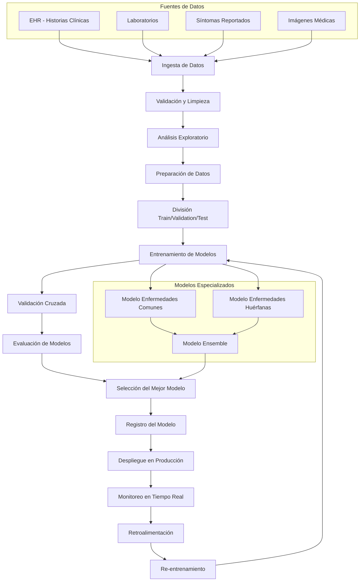

# Diseño del Pipeline de MLOps para Diagnóstico Médico

## 🎯 Descripción

Este documento describe el diseño de un pipeline de MLOps completo para el diagnóstico médico, capaz de manejar tanto enfermedades comunes (con abundantes datos) como enfermedades huérfanas (con datos limitados). El sistema está diseñado para ser robusto, escalable y mantenible en un entorno de producción médico.

---

## 📊 Diagrama del Pipeline

---

## 🔍 1. Diseño y Análisis

### 1.1 Restricciones y Limitaciones

**Restricciones Técnicas:**

- **Privacidad de Datos**: Cumplimiento estricto con HIPAA y regulaciones de protección de datos médicos
- **Latencia**: Respuesta en tiempo real (< 2 segundos) para diagnósticos urgentes
- **Disponibilidad**: 99.9% de uptime para servicios críticos
- **Escalabilidad**: Capacidad de manejar 10,000+ consultas diarias

**Restricciones Médicas:**

- **Precisión**: Sensibilidad > 95% para enfermedades agudas
- **Especificidad**: Evitar falsos positivos que generen ansiedad
- **Interpretabilidad**: Explicabilidad de las decisiones para médicos
- **Validación Clínica**: Aprobación de comités médicos especializados

### 1.2 Tipos de Datos

**Datos Estructurados:**

- Signos vitales (temperatura, presión arterial, frecuencia cardíaca)
- Resultados de laboratorio (hemograma, química sanguínea)
- Medicamentos actuales y alergias
- Historial médico familiar

**Datos No Estructurados:**

- Notas de síntomas del paciente
- Reportes de radiología
- Imágenes médicas (rayos X, resonancias)
- Transcripciones de consultas

**Datos Temporales:**

- Evolución de síntomas a lo largo del tiempo
- Patrones de medicación
- Respuesta a tratamientos previos

---

## 🛠️ 2. Desarrollo

### 2.1 Fuentes de Datos y Manejo

**Fuentes Principales:**

1. **Sistemas EHR (Electronic Health Records)**

   - Epic, Cerner, Allscripts
   - APIs estandarizadas (FHIR)
   - Sincronización en tiempo real
2. **Laboratorios Externos**

   - HL7 para resultados de laboratorio
   - Integración con sistemas LIS (Laboratory Information Systems)
3. **Dispositivos IoT Médicos**

   - Monitores de signos vitales
   - Dispositivos de telemedicina
   - Aplicaciones móviles de pacientes

**Estrategia de Manejo de Datos:**

- **Ingesta en Tiempo Real**: Apache Kafka para streaming de datos
- **Almacenamiento**: Data Lake (AWS S3/Azure Blob) + Data Warehouse (Snowflake/BigQuery)
- **Procesamiento**: Apache Spark para transformaciones masivas
- **Versionado**: DVC (Data Version Control) para trazabilidad

### 2.2 Tipos de Modelos de ML

**Para Enfermedades Comunes (Datos Abundantes):**

- **Deep Learning**: Redes neuronales profundas para patrones complejos
- **Ensemble Methods**: Random Forest, XGBoost, LightGBM
- **Modelos de Secuencia**: LSTM/GRU para datos temporales
- **Modelos de Imagen**: CNN para análisis de radiografías

**Para Enfermedades Huérfanas (Datos Limitados):**

- **Few-Shot Learning**: Modelos que aprenden con pocos ejemplos
- **Transfer Learning**: Aprovechar modelos pre-entrenados
- **Meta-Learning**: MAML (Model-Agnostic Meta-Learning)
- **Síntesis de Datos**: GANs para generar datos sintéticos
- **Modelos de Base de Conocimiento**: Incorporar literatura médica

**Modelos Híbridos:**

- **Ensemble Adaptativo**: Combina modelos según disponibilidad de datos
- **Modelos de Explicabilidad**: SHAP, LIME para interpretabilidad
- **Modelos de Incertidumbre**: Bayesian Neural Networks

### 2.3 Validación y Testing

**Estrategia de Validación:**

- **Validación Cruzada Temporal**: Respetando la cronología de los datos
- **Validación por Especialidad**: Diferentes especialidades médicas
- **Validación por Demografía**: Diferentes grupos de edad, género, etnia
- **Validación Externa**: Datos de hospitales independientes

**Métricas de Evaluación:**

- **Métricas Clínicas**: Sensibilidad, Especificidad, Valor Predictivo Positivo
- **Métricas de Calidad**: AUC-ROC, F1-Score, Precision-Recall
- **Métricas de Equidad**: Paridad demográfica, igualdad de oportunidades
- **Métricas de Robustez**: Resistencia a adversarios, generalización

**Testing Automatizado:**

- **Unit Tests**: Para funciones individuales
- **Integration Tests**: Para flujos completos
- **Performance Tests**: Para latencia y throughput
- **A/B Testing**: Para comparar versiones de modelos

---

## 🚀 3. Producción

### 3.1 Despliegue de la Solución

**Arquitectura de Microservicios:**

- **API Gateway**: Kong o AWS API Gateway
- **Servicios de Modelo**: Contenedores Docker independientes
- **Base de Datos**: PostgreSQL para metadatos, Redis para caché
- **Message Queue**: RabbitMQ para procesamiento asíncrono

**Estrategia de Despliegue:**

- **Blue-Green Deployment**: Para actualizaciones sin downtime
- **Canary Releases**: Despliegue gradual a subconjuntos de usuarios
- **Feature Flags**: Activación/desactivación de funcionalidades
- **Rollback Automático**: En caso de degradación de performance

**Infraestructura:**

- **Orquestación**: Kubernetes para escalabilidad
- **CI/CD**: GitLab CI/CD o GitHub Actions
- **Configuración**: Helm charts para Kubernetes
- **Secrets Management**: HashiCorp Vault o AWS Secrets Manager

### 3.2 Monitoreo y Observabilidad

**Monitoreo en Tiempo Real:**

- **Métricas de Performance**: Latencia, throughput, error rate
- **Métricas de Modelo**: Drift de datos, degradación de accuracy
- **Métricas de Negocio**: Número de diagnósticos, satisfacción del usuario
- **Alertas Inteligentes**: Basadas en umbrales adaptativos

**Herramientas de Monitoreo:**

- **APM**: New Relic, Datadog, o Prometheus + Grafana
- **Logging**: ELK Stack (Elasticsearch, Logstash, Kibana)
- **Tracing**: Jaeger o Zipkin para trazabilidad distribuida
- **Model Monitoring**: MLflow, Weights & Biases, o custom dashboards

**Dashboards Ejecutivos:**

- **Dashboard Clínico**: Para médicos y personal sanitario
- **Dashboard Técnico**: Para ingenieros de ML
- **Dashboard de Negocio**: Para administradores hospitalarios

### 3.3 Re-entrenamiento y Actualización

**Estrategia de Re-entrenamiento:**

- **Trigger Automático**: Basado en drift de datos o degradación de performance
- **Re-entrenamiento Programado**: Semanal para modelos críticos
- **Re-entrenamiento por Lotes**: Para modelos menos críticos
- **Online Learning**: Para adaptación continua (donde sea apropiado)

**Validación de Nuevos Modelos:**

- **Shadow Mode**: Ejecutar nuevo modelo en paralelo sin afectar producción
- **Champion-Challenger**: Comparar modelo actual vs nuevo modelo
- **Validación Clínica**: Revisión por especialistas médicos
- **A/B Testing**: Pruebas controladas con subconjuntos de pacientes

**Gestión de Versiones:**

- **Model Registry**: MLflow o DVC para versionado de modelos
- **Metadata Tracking**: Parámetros, métricas, y datos de entrenamiento
- **Lineage Tracking**: Trazabilidad completa del modelo
- **Rollback Strategy**: Capacidad de revertir a versiones anteriores

---

## 🔒 Consideraciones de Seguridad y Compliance

### Privacidad de Datos

- **Encriptación**: En tránsito (TLS 1.3) y en reposo (AES-256)
- **Anonimización**: Técnicas de k-anonymity y differential privacy
- **Acceso Controlado**: RBAC (Role-Based Access Control)
- **Auditoría**: Logs completos de acceso y modificaciones

### Compliance Médico

- **HIPAA**: Cumplimiento estricto para datos de salud
- **GDPR**: Para pacientes en la Unión Europea
- **FDA**: Si el sistema se considera dispositivo médico
- **Certificaciones**: ISO 27001, SOC 2 Type II

---

## 📈 Métricas de Éxito

### Métricas Técnicas

- **Disponibilidad**: > 99.9%
- **Latencia**: < 2 segundos para diagnósticos
- **Precisión**: > 95% para enfermedades agudas
- **Escalabilidad**: 10,000+ consultas diarias

### Métricas de Negocio

- **Adopción**: % de médicos usando el sistema
- **Satisfacción**: NPS > 8.0
- **Eficiencia**: Reducción del 30% en tiempo de diagnóstico
- **ROI**: Retorno de inversión en 18 meses

### Métricas Clínicas

- **Detección Temprana**: 40% más diagnósticos tempranos
- **Reducción de Errores**: 25% menos diagnósticos incorrectos
- **Tiempo de Respuesta**: 50% más rápido en emergencias
- **Satisfacción del Paciente**: Mejora en experiencia del paciente
