# Pipeline de MLOps para Diagnóstico Médico - Versión 2.0 (Taller #3)

## 🎯 Descripción

Este documento describe el diseño **reestructurado y mejorado** de un pipeline de MLOps end-to-end para diagnóstico médico, incorporando tecnologías modernas de MLOps, orquestación, monitoreo y despliegue escalable en la nube.

**Problema a resolver:**
Construir un modelo que prediga, dados los síntomas de un paciente, si sufre de alguna enfermedad (común o huérfana), con un pipeline completo que soporte:

- Despliegue local (para médicos con recursos limitados)
- Despliegue en la nube (para acceso distribuido)
- Manejo de enfermedades comunes (muchos datos) y huérfanas (pocos datos)
- Cumplimiento normativo (HIPAA, GDPR)

---

## 📊 Diagrama del Pipeline MLOps End-to-End

```mermaid
graph TB
    subgraph "1. INGESTA Y ALMACENAMIENTO DE DATOS"
        A1[Azure Data Factory] --> A2[Azure Data Lake Gen2]
        A3[Fuentes: EHR/HL7/FHIR] --> A1
        A4[APIs de Hospitales] --> A1
        A2 --> A5[Delta Lake en Databricks]
    end

    subgraph "2. PROCESAMIENTO Y FEATURE ENGINEERING"
        A5 --> B1[Databricks Notebooks]
        B1 --> B2[Apache Spark para ETL]
        B2 --> B3[Feature Store - Databricks]
        B4[Great Expectations] -.validación.-> B2
        B5[DVC - Version Control] -.versionado.-> A5
    end

    subgraph "3. ENTRENAMIENTO DE MODELOS"
        B3 --> C1[MLflow Experiments]
        C1 --> C2[Modelo: Enfermedades Comunes]
        C1 --> C3[Modelo: Enfermedades Huérfanas]
        C1 --> C4[Few-Shot Learning]
      
        C2 --> C5[Ensemble Model]
        C3 --> C5
        C4 --> C3
      
        C5 --> C6[MLflow Model Registry]
      
        C7[Hyperparameter Tuning - Optuna] --> C1
        C8[AutoML - Databricks] -.opcional.-> C1
    end

    subgraph "4. VALIDACIÓN Y TESTING"
        C6 --> D1[Testing Automático]
        D1 --> D2[Unit Tests - Pytest]
        D1 --> D3[Integration Tests]
        D1 --> D4[Model Validation]
        D4 --> D5[Métricas Clínicas]
        D5 --> D6[Validación por Expertos]
    end

    subgraph "5. CI/CD PIPELINE"
        D6 --> E1[Azure DevOps / GitHub Actions]
        E1 --> E2[Build & Test]
        E2 --> E3[Containerización - Docker]
        E3 --> E4[Azure Container Registry]
        E4 --> E5[Deploy a Staging]
        E5 --> E6[A/B Testing]
        E6 --> E7[Deploy a Producción]
    end

    subgraph "6. DESPLIEGUE EN PRODUCCIÓN"
        E7 --> F1[Azure Kubernetes Service]
        E7 --> F2[Azure Machine Learning Endpoints]
      
        F1 --> F3[API REST - FastAPI]
        F2 --> F3
      
        F3 --> F4[Azure API Management]
        F4 --> F5[Médico - Aplicación Web]
        F4 --> F6[Médico - App Móvil]
        F4 --> F7[Integración con EHR]
      
        F8[Azure Functions] -.batch inference.-> F3
    end

    subgraph "7. MONITOREO Y OBSERVABILIDAD"
        F3 --> G1[Azure Monitor]
        F3 --> G2[Application Insights]
        G1 --> G3[Prometheus]
        G3 --> G4[Grafana Dashboards]
      
        G5[Evidently AI] -.data drift.-> G3
        G6[Seldon Alibi] -.explicabilidad.-> F3
      
        G4 --> G7[Alertas Automáticas]
    end

    subgraph "8. REENTRENAMIENTO Y MEJORA CONTINUA"
        G7 --> H1[Azure Logic Apps]
        H1 --> H2[Trigger Reentrenamiento]
        H2 --> H3[Databricks Jobs]
        H3 --> B1
      
        H4[Feedback de Médicos] --> H5[Azure Cosmos DB]
        H5 --> H2
    end

    subgraph "9. SEGURIDAD Y GOBERNANZA"
        I1[Azure Active Directory] --> F4
        I2[Azure Key Vault] --> F1
        I3[Azure Policy] -.compliance.-> A2
        I4[Audit Logs] --> G1
        I5[Encriptación] --> A2
    end

    style A1 fill:#0078D4
    style A5 fill:#FF6C37
    style C1 fill:#0194E2
    style C6 fill:#0194E2
    style F1 fill:#326CE5
    style F3 fill:#009485
    style G4 fill:#F46800
```



---

## 🏗️ ARQUITECTURA DETALLADA POR ETAPAS

### **ETAPA 1: Ingesta y Almacenamiento de Datos**

#### **Tecnologías:**

- **Azure Data Factory (ADF):** Orquestación de pipelines de ingesta
- **Azure Data Lake Storage Gen2:** Almacenamiento escalable de datos crudos
- **Delta Lake (Databricks):** Formato de almacenamiento con ACID transactions
- **Apache Kafka (Azure Event Hubs):** Streaming de datos en tiempo real

#### **Justificación:**

- **ADF** permite conectar múltiples fuentes heterogéneas (EHR, laboratorios, APIs) sin código
- **ADLS Gen2** ofrece almacenamiento económico y escalable con particionado jerárquico
- **Delta Lake** proporciona versionado de datos, time travel y calidad transaccional
- **Event Hubs** permite ingestión en tiempo real de síntomas críticos (urgencias)

#### **Suposiciones:**

- Los datos vienen en formatos estándar de salud: HL7, FHIR, JSON
- Existen integraciones seguras con sistemas hospitalarios (VPN, API con OAuth2)
- Los datos históricos están disponibles para entrenamiento inicial (>10,000 registros)

#### **Flujo de datos:**

1. ADF se conecta a fuentes de datos cada hora (batch) o en tiempo real (streaming)
2. Datos crudos se escriben en ADLS Gen2 en formato parquet particionado por fecha
3. Databricks lee desde ADLS y carga en Delta Lake con schema enforcement
4. Se mantienen 3 capas: Bronze (raw), Silver (cleaned), Gold (features)

#### **Consideraciones de privacidad:**

- Encriptación en tránsito (TLS 1.3) y reposo (AES-256)
- Anonimización de datos personales usando Azure Purview
- Cumplimiento con HIPAA mediante Azure Compliance Manager

---

### **ETAPA 2: Procesamiento y Feature Engineering**

#### **Tecnologías:**

- **Databricks Notebooks + Apache Spark:** Procesamiento distribuido
- **Feature Store (Databricks):** Gestión centralizada de features
- **Great Expectations:** Validación de calidad de datos
- **DVC (Data Version Control):** Versionado de datasets
- **PySpark + Pandas UDFs:** Transformaciones personalizadas

#### **Justificación:**

- **Spark** escala horizontalmente para procesar millones de registros históricos
- **Feature Store** evita duplicación y asegura consistencia entre entrenamiento e inferencia
- **Great Expectations** valida automáticamente esquemas, rangos y distribuciones
- **DVC** trackea versiones de datasets y permite reproducibilidad

#### **Procesamiento de síntomas:**

```python
# Ejemplo de feature engineering
- Normalización de escalas de dolor (0-10 estandarizado)
- Encoding de síntomas categóricos (one-hot, target encoding)
- Agregaciones temporales (síntomas últimas 24h, 7 días)
- Interacciones entre síntomas críticos (fiebre + dolor_pecho)
- Embeddings de texto (descripciones en lenguaje natural con BioBERT)
- Imputación de valores faltantes (KNN, MICE)
```

#### **Feature Store:**

- **Features para enfermedades comunes:** 150+ features de síntomas, demographics, historial
- **Features para enfermedades huérfanas:** 50+ features clave + embeddings de casos similares
- **Actualización:** Online (streaming) y Offline (batch)
- **Serving:** API de baja latencia (<50ms) para inferencia

#### **Validación de datos:**

```yaml
# Great Expectations suite
expectations:
  - expect_column_values_to_be_between:
      column: temperatura
      min: 35.0
      max: 42.0
  - expect_column_values_to_not_be_null:
      column: sintoma_principal
  - expect_table_row_count_to_be_between:
      min: 100
```

---

### **ETAPA 3: Entrenamiento de Modelos**

#### **Tecnologías:**

- **MLflow (Databricks):** Tracking, registro y gestión de modelos
- **Azure Machine Learning:** Plataforma alternativa/complementaria
- **Optuna / Hyperopt:** Hyperparameter tuning automático
- **AutoML (Databricks):** Exploración rápida de modelos base
- **Frameworks:** Scikit-learn, XGBoost, LightGBM, PyTorch

#### **Estrategia de modelado:**

##### **Modelo 1: Enfermedades Comunes (muchos datos)**

- **Algoritmos:** XGBoost, LightGBM, Random Forest Ensemble
- **Datos:** >10,000 casos por condición
- **Entrenamiento:** Databricks cluster con GPUs (Standard_NC6s_v3)
- **Métricas:** Accuracy, F1-score, AUC-ROC
- **Validación:** 5-fold cross-validation estratificada

##### **Modelo 2: Enfermedades Huérfanas (pocos datos)**

- **Estrategia:** Few-shot learning + Transfer learning
- **Base model:** Modelo preentrenado en datos médicos generales
- **Fine-tuning:** <100 ejemplos por condición rara
- **Técnicas:** Data augmentation, SMOTE, Siamese Networks
- **Prioridad:** Alta sensibilidad (recall) para no perder casos críticos

##### **Modelo 3: Ensemble Final**

- **Arquitectura:** Stacking con meta-learner
- **Lógica de agregación:**
  - Si Modelo 2 predice enfermedad huérfana con confianza >0.7 → alarma
  - Si Modelo 1 + Modelo 2 coinciden en severidad → salida directa
  - Si hay discrepancia → escalar al caso más grave (principio de precaución clínica)

#### **MLflow Tracking:**

```python
import mlflow
with mlflow.start_run(run_name="ensemble_v2.3"):
    mlflow.log_params({
        "n_estimators": 500,
        "max_depth": 10,
        "learning_rate": 0.05
    })
    mlflow.log_metrics({
        "train_f1": 0.92,
        "val_f1": 0.88,
        "sensibilidad_casos_criticos": 0.95
    })
    mlflow.sklearn.log_model(model, "model")
    mlflow.log_artifact("confusion_matrix.png")
```

#### **Hyperparameter Tuning:**

- **Optuna** con Bayesian optimization
- **Búsqueda distribuida** en Databricks cluster
- **Early stopping** basado en validación
- **Presupuesto:** 500 trials por experimento

#### **Model Registry:**

- **Staging:** Modelo recién entrenado, en pruebas
- **Production:** Modelo activo sirviendo inferencias
- **Archived:** Modelos antiguos para auditoría
- **Transiciones:** Requieren aprobación manual + validación clínica

---

### **ETAPA 4: Validación y Testing**

#### **Tecnologías:**

- **Pytest:** Unit tests y integration tests
- **Great Expectations:** Data validation
- **Deepchecks:** Validación específica de ML
- **SHAP / LIME:** Explicabilidad de modelos

#### **Niveles de testing:**

##### **1. Unit Tests**

```python
def test_model_input_validation():
    """Valida que el modelo rechace inputs inválidos"""
    assert model.predict({"fiebre": -5}) raises ValueError

def test_model_output_range():
    """Valida que las predicciones estén en rango esperado"""
    pred = model.predict(valid_input)
    assert pred["severidad"] in [0, 1, 2, 3, 4]
```

##### **2. Integration Tests**

- Test de pipeline completo (ingesta → predicción)
- Test de latencia (<500ms p99)
- Test de throughput (>100 requests/segundo)

##### **3. Model Validation**

- **Métricas clínicas específicas:**
  - Sensibilidad casos urgentes: >95%
  - Especificidad casos leves: >80%
  - NPV (Negative Predictive Value): >98%
- **Análisis de subgrupos:**
  - Por edad (pediatría, adultos, geriatría)
  - Por género
  - Por tipo de enfermedad
- **Fairness metrics:**
  - Disparate impact <1.2
  - Equal opportunity difference <0.05

##### **4. Explicabilidad**

- **SHAP values** para cada predicción individual
- Dashboard de feature importance
- Ejemplos contrafactuales ("Si la fiebre fuera 38°C en vez de 40°C...")

##### **5. Validación por Expertos Médicos**

- **Panel de 5+ médicos** revisan 100 casos aleatorios
- **Checklist de validación:**
  - ¿La predicción es clínicamente razonable?
  - ¿La explicación es interpretable?
  - ¿Falta información crítica?
  - ¿El nivel de severidad es apropiado?
- **Criterio de aprobación:** >90% de acuerdo médico

---

### **ETAPA 5: CI/CD Pipeline**

#### **Tecnologías:**

- **Azure DevOps Pipelines / GitHub Actions:** Orquestación CI/CD
- **Docker:** Containerización reproducible
- **Azure Container Registry (ACR):** Registro privado de imágenes
- **Terraform / ARM Templates:** Infrastructure as Code
- **pytest + coverage:** Testing automatizado

#### **Pipeline CI/CD:**

```yaml
# azure-pipelines.yml (ejemplo simplificado)
trigger:
  branches:
    - main
    - develop

stages:
  - stage: Build
    jobs:
      - job: BuildTest
        steps:
          - task: UsePythonVersion@0
            inputs:
              versionSpec: '3.10'
          - script: |
              pip install -r requirements.txt
              pytest tests/ --cov=src --cov-report=xml
          - task: PublishCodeCoverageResults@1

  - stage: BuildDocker
    jobs:
      - job: Docker
        steps:
          - task: Docker@2
            inputs:
              command: 'buildAndPush'
              repository: 'medical-diagnosis-mlops'
              tags: |
                $(Build.BuildId)
                latest

  - stage: DeployStaging
    jobs:
      - job: DeployAKS
        steps:
          - task: Kubernetes@1
            inputs:
              command: 'apply'
              namespace: 'staging'
              manifests: 'k8s/deployment-staging.yaml'

  - stage: ABTesting
    jobs:
      - job: RunABTest
        steps:
          - script: python scripts/ab_test.py --duration=24h

  - stage: DeployProduction
    condition: succeeded()
    jobs:
      - job: DeployProd
        steps:
          - task: Kubernetes@1
            inputs:
              command: 'apply'
              namespace: 'production'
              manifests: 'k8s/deployment-prod.yaml'
```

#### **Containerización:**

```dockerfile
# Dockerfile optimizado para producción
FROM python:3.10-slim

# Instalar dependencias del sistema
RUN apt-get update && apt-get install -y --no-install-recommends \
    gcc \
    && rm -rf /var/lib/apt/lists/*

# Crear usuario no-root
RUN useradd -m -u 1000 mlops
USER mlops

WORKDIR /app

# Copiar requirements y instalar
COPY --chown=mlops:mlops requirements.txt .
RUN pip install --no-cache-dir -r requirements.txt

# Copiar código y modelo
COPY --chown=mlops:mlops src/ ./src/
COPY --chown=mlops:mlops models/ ./models/

# Health check
HEALTHCHECK --interval=30s --timeout=10s --retries=3 \
  CMD curl -f http://localhost:8000/health || exit 1

# Exponer puerto
EXPOSE 8000

# Comando de inicio
CMD ["uvicorn", "src.main:app", "--host", "0.0.0.0", "--port", "8000"]
```

#### **Estrategias de despliegue:**

- **Blue-Green Deployment:** Dos entornos idénticos, switch instantáneo
- **Canary Release:** 5% → 25% → 50% → 100% del tráfico gradualmente
- **A/B Testing:** Comparar modelo nuevo vs antiguo con métricas de negocio

---

### **ETAPA 6: Despliegue en Producción**

#### **Tecnologías:**

- **Azure Kubernetes Service (AKS):** Orquestación de contenedores
- **Azure Machine Learning Endpoints:** Endpoints gestionados (alternativa)
- **FastAPI:** Framework para API REST de alto rendimiento
- **Azure API Management:** Gateway centralizado con políticas
- **Azure Functions:** Inferencia batch asíncrona
- **NGINX Ingress Controller:** Load balancing y TLS termination

#### **Arquitectura de despliegue:**

##### **Opción 1: Despliegue en AKS (Recomendado)**

```yaml
# k8s/deployment-prod.yaml
apiVersion: apps/v1
kind: Deployment
metadata:
  name: medical-diagnosis-api
  namespace: production
spec:
  replicas: 3
  selector:
    matchLabels:
      app: medical-diagnosis
  template:
    metadata:
      labels:
        app: medical-diagnosis
        version: v2.0
    spec:
      containers:
      - name: api
        image: <ACR>.azurecr.io/medical-diagnosis:latest
        ports:
        - containerPort: 8000
        resources:
          requests:
            memory: "512Mi"
            cpu: "500m"
          limits:
            memory: "2Gi"
            cpu: "2000m"
        env:
        - name: MODEL_PATH
          value: "/models/ensemble_v2"
        - name: AZURE_KEY_VAULT_URL
          valueFrom:
            secretKeyRef:
              name: app-secrets
              key: key-vault-url
        livenessProbe:
          httpGet:
            path: /health
            port: 8000
          initialDelaySeconds: 30
          periodSeconds: 10
        readinessProbe:
          httpGet:
            path: /ready
            port: 8000
          initialDelaySeconds: 10
          periodSeconds: 5
---
apiVersion: v1
kind: Service
metadata:
  name: medical-diagnosis-service
spec:
  type: LoadBalancer
  ports:
  - port: 80
    targetPort: 8000
  selector:
    app: medical-diagnosis
---
apiVersion: autoscaling/v2
kind: HorizontalPodAutoscaler
metadata:
  name: medical-diagnosis-hpa
spec:
  scaleTargetRef:
    apiVersion: apps/v1
    kind: Deployment
    name: medical-diagnosis-api
  minReplicas: 3
  maxReplicas: 20
  metrics:
  - type: Resource
    resource:
      name: cpu
      target:
        type: Utilization
        averageUtilization: 70
  - type: Resource
    resource:
      name: memory
      target:
        type: Utilization
        averageUtilization: 80
```

##### **Opción 2: Azure ML Managed Endpoints (Alternativa simplificada)**

- Para equipos pequeños sin experiencia en Kubernetes
- Azure gestiona infraestructura, escalado, monitoreo
- Más costoso pero menos overhead operacional

#### **API REST con FastAPI:**

```python
# src/main.py
from fastapi import FastAPI, HTTPException
from pydantic import BaseModel, Field, validator
import mlflow
import numpy as np
from typing import Dict, List
import logging

app = FastAPI(title="Medical Diagnosis API", version="2.0")

# Cargar modelo al inicio
model = mlflow.pyfunc.load_model("models/ensemble_v2")
logger = logging.getLogger(__name__)

class SymptomsInput(BaseModel):
    """Schema de entrada de síntomas"""
    patient_id: str = Field(..., description="ID anónimo del paciente")
    symptoms: Dict[str, float] = Field(
        ..., 
        description="Diccionario de síntomas y su intensidad (0-10)",
        example={
            "fiebre": 8.5,
            "dolor_pecho": 7.0,
            "dificultad_respirar": 6.5,
            "fatiga": 5.0
        }
    )
    age: int = Field(..., ge=0, le=120)
    gender: str = Field(..., regex="^(M|F|O)$")
    medical_history: List[str] = Field(default=[], description="Historial médico")
  
    @validator('symptoms')
    def validate_symptoms(cls, v):
        """Valida que los síntomas estén en rango válido"""
        for symptom, intensity in v.items():
            if not 0 <= intensity <= 10:
                raise ValueError(f"Intensidad de '{symptom}' debe estar entre 0 y 10")
        if len(v) < 3:
            raise ValueError("Se requieren al menos 3 síntomas")
        return v

class DiagnosisOutput(BaseModel):
    """Schema de salida del diagnóstico"""
    patient_id: str
    severity: str  # NO_ENFERMO, MOLESTIAS_LEVES, ENFERMEDAD_LEVE, ENFERMEDAD_AGUDA, ENFERMEDAD_CRONICA
    confidence: float
    top_conditions: List[Dict[str, float]]
    recommendations: List[str]
    requires_immediate_attention: bool
    explanation: Dict[str, float]  # SHAP values

@app.post("/predict", response_model=DiagnosisOutput)
async def predict_diagnosis(input_data: SymptomsInput):
    """
    Endpoint principal de predicción de diagnóstico.
  
    - **patient_id**: Identificador anónimo del paciente
    - **symptoms**: Diccionario de síntomas con intensidad 0-10
    - **age**: Edad del paciente
    - **gender**: Género (M/F/O)
    """
    try:
        # Preprocesar input
        features = preprocess_input(input_data)
      
        # Predicción
        prediction = model.predict(features)
      
        # Post-procesamiento
        output = postprocess_prediction(prediction, input_data.patient_id)
      
        # Log para auditoría
        logger.info(f"Prediction for patient {input_data.patient_id}: {output.severity}")
      
        return output
      
    except Exception as e:
        logger.error(f"Error en predicción: {str(e)}")
        raise HTTPException(status_code=500, detail=f"Error en predicción: {str(e)}")

@app.get("/health")
async def health_check():
    """Health check para Kubernetes liveness probe"""
    return {"status": "healthy", "model_loaded": model is not None}

@app.get("/ready")
async def readiness_check():
    """Readiness check para Kubernetes readiness probe"""
    try:
        # Test rápido del modelo
        dummy_input = np.zeros((1, model.metadata.get_input_schema().shape[1]))
        _ = model.predict(dummy_input)
        return {"status": "ready"}
    except:
        raise HTTPException(status_code=503, detail="Model not ready")

@app.get("/metrics")
async def get_metrics():
    """Endpoint de métricas para Prometheus"""
    # Métricas en formato Prometheus
    return {
        "predictions_total": 12500,
        "predictions_per_severity": {
            "NO_ENFERMO": 4500,
            "MOLESTIAS_LEVES": 3200,
            "ENFERMEDAD_LEVE": 2800,
            "ENFERMEDAD_AGUDA": 1500,
            "ENFERMEDAD_CRONICA": 500
        },
        "avg_latency_ms": 145,
        "p99_latency_ms": 380
    }

def preprocess_input(input_data: SymptomsInput) -> np.ndarray:
    """Preprocesa los datos de entrada para el modelo"""
    # Implementación de feature engineering
    # (debe coincidir exactamente con el entrenamiento)
    pass

def postprocess_prediction(prediction, patient_id: str) -> DiagnosisOutput:
    """Post-procesa la salida del modelo"""
    # Implementación de lógica de negocio
    pass
```

#### **Azure API Management:**

- **Políticas de seguridad:**
  - Autenticación OAuth2 / API Keys
  - Rate limiting (100 requests/minuto por usuario)
  - IP whitelisting para hospitales
  - Validación de JWT tokens
- **Transformaciones:**
  - Normalización de headers
  - Enriquecimiento de requests con metadata
- **Caching:**
  - Cache de diagnósticos para mismos síntomas (1 hora)
- **Analytics:**
  - Dashboard de uso por hospital/médico
  - Tiempos de respuesta por endpoint

#### **Inferencia Batch (Azure Functions):**

Para procesamiento nocturno de casos no urgentes:

```python
# function_app.py
import azure.functions as func
import mlflow

app = func.FunctionApp()

@app.function_name(name="BatchInference")
@app.schedule(schedule="0 0 2 * * *", arg_name="mytimer")  # 2 AM diario
def batch_inference(mytimer: func.TimerRequest) -> None:
    """Procesa casos no urgentes en batch"""
    # Leer casos pendientes de Cosmos DB
    # Ejecutar inferencia en batch
    # Guardar resultados
    pass
```

---

### **ETAPA 7: Monitoreo y Observabilidad**

#### **Tecnologías:**

- **Azure Monitor:** Monitoreo centralizado de infraestructura
- **Application Insights:** Telemetría de aplicaciones
- **Prometheus:** Métricas de tiempo real
- **Grafana:** Dashboards visuales
- **Evidently AI:** Detección de data drift y model drift
- **Seldon Alibi:** Explicabilidad y detección de outliers
- **Azure Log Analytics:** Logs centralizados
- **PagerDuty / Azure Alerts:** Sistema de alertas

#### **Métricas monitoreadas:**

##### **1. Métricas de Infraestructura**

- CPU, memoria, disco por pod
- Latencia de red
- Disponibilidad del servicio (SLA 99.9%)
- Throughput (requests/segundo)

##### **2. Métricas de Aplicación**

```python
# Métricas custom con Prometheus client
from prometheus_client import Counter, Histogram, Gauge

# Contador de predicciones
predictions_total = Counter(
    'predictions_total', 
    'Total de predicciones realizadas',
    ['severity', 'model_version']
)

# Histograma de latencia
prediction_latency = Histogram(
    'prediction_latency_seconds',
    'Latencia de predicción en segundos',
    buckets=[0.05, 0.1, 0.2, 0.5, 1.0, 2.0]
)

# Gauge de confianza promedio
avg_confidence = Gauge(
    'avg_prediction_confidence',
    'Confianza promedio de predicciones últimas 1000'
)
```

##### **3. Métricas de ML**

```python
# Detección de data drift con Evidently
from evidently.metric_preset import DataDriftPreset
from evidently.report import Report

report = Report(metrics=[
    DataDriftPreset()
])

report.run(
    reference_data=training_data,  # Datos de entrenamiento
    current_data=production_data   # Datos de producción última semana
)

drift_metrics = report.as_dict()
# Alertar si drift > umbral
if drift_metrics['data_drift']['dataset_drift']:
    send_alert("Data drift detectado!")
```

**Métricas específicas:**

- **Data Drift:** Comparación de distribuciones de features (KS test, PSI)
- **Prediction Drift:** Cambio en distribución de predicciones
- **Concept Drift:** Degradación de métricas (F1, Recall)
- **Feature Importance Drift:** Cambios en importancia de features

##### **4. Métricas Clínicas**

- Tasa de casos urgentes detectados vs perdidos (Daily)
- Tasa de falsos positivos (alarmas innecesarias)
- Tiempo promedio de respuesta API (target <500ms p99)
- Acuerdo con diagnósticos posteriores (validación retrospectiva)

#### **Dashboards de Grafana:**

**Dashboard 1: Operacional**

- Requests/segundo (línea de tiempo)
- Latencia p50, p95, p99 (últimas 24h)
- Tasa de errores 4xx, 5xx
- Pods activos y saludables
- CPU y memoria por pod

**Dashboard 2: ML Performance**

- Distribución de severidades predichas (pie chart)
- Confianza promedio por hora (línea de tiempo)
- Data drift score (gauge)
- Top 10 features con mayor drift
- Comparación modelo actual vs baseline

**Dashboard 3: Clínico**

- Casos urgentes detectados (contador)
- Tiempo respuesta para casos críticos
- Feedback de médicos (rating promedio)
- Casos que requieren revisión manual

#### **Sistema de Alertas:**

```yaml
# alertas.yaml (Prometheus AlertManager)
groups:
  - name: ml_model_alerts
    interval: 30s
    rules:
      - alert: HighErrorRate
        expr: rate(http_requests_total{status="500"}[5m]) > 0.05
        for: 5m
        labels:
          severity: critical
        annotations:
          summary: "Tasa de error alta en API"
          description: "{{ $value }} errores por segundo"

      - alert: DataDriftDetected
        expr: evidently_data_drift_score > 0.7
        for: 1h
        labels:
          severity: warning
        annotations:
          summary: "Data drift detectado"
          description: "Score de drift: {{ $value }}"

      - alert: HighLatency
        expr: histogram_quantile(0.99, prediction_latency_seconds) > 1.0
        for: 10m
        labels:
          severity: warning
        annotations:
          summary: "Latencia p99 alta"
          description: "p99: {{ $value }}s"

      - alert: LowModelConfidence
        expr: avg_prediction_confidence < 0.6
        for: 30m
        labels:
          severity: warning
        annotations:
          summary: "Confianza del modelo baja"
          description: "Confianza promedio: {{ $value }}"
```

**Canales de notificación:**

- **Critical:** PagerDuty → Llamada telefónica al equipo de guardia
- **Warning:** Microsoft Teams / Slack channel
- **Info:** Email al equipo de ML

#### **Explicabilidad en producción:**

```python
# Generar explicaciones SHAP en cada predicción
import shap

explainer = shap.TreeExplainer(model)

def explain_prediction(input_features):
    """Genera explicación SHAP para una predicción"""
    shap_values = explainer.shap_values(input_features)
  
    explanation = {
        "top_positive_features": [
            {"feature": "fiebre", "impact": +2.3},
            {"feature": "dolor_pecho", "impact": +1.8},
        ],
        "top_negative_features": [
            {"feature": "edad_joven", "impact": -0.5}
        ],
        "base_value": 0.3,
        "final_value": 4.1  # Predicción final
    }
  
    return explanation
```

**Almacenamiento de explicaciones:**

- Guardar explicaciones en Azure Cosmos DB para auditoría
- Disponibles para revisión médica posterior
- Usadas en reportes de transparencia

---

### **ETAPA 8: Reentrenamiento y Mejora Continua**

#### **Tecnologías:**

- **Databricks Jobs:** Orquestación de reentrenamiento automatizado
- **Azure Logic Apps:** Workflows automatizados
- **Azure Cosmos DB:** Almacenamiento de feedback médico
- **MLflow:** Tracking de experimentos de reentrenamiento
- **Airflow (opcional):** Orquestación compleja de pipelines

#### **Estrategia de reentrenamiento:**

##### **Triggers automáticos:**

1. **Reentrenamiento programado:** Cada 2 semanas (mínimo)
2. **Drift detectado:** Si data drift > 0.7 por >24h
3. **Degradación de métricas:** Si F1 cae >5% respecto baseline
4. **Acumulación de feedback:** Cada 500 nuevos casos con feedback médico

##### **Pipeline de reentrenamiento:**

```python
# databricks_job.py
from databricks import feature_store
import mlflow

def retraining_pipeline():
    """Pipeline completo de reentrenamiento"""
  
    # 1. Extraer nuevos datos
    new_data = extract_new_data(
        start_date=last_training_date,
        end_date=datetime.now()
    )
  
    # 2. Validar calidad de datos
    validation_report = validate_data_quality(new_data)
    if not validation_report.passed:
        raise Exception("Datos no pasan validación")
  
    # 3. Combinar con datos históricos
    training_data = combine_datasets(historical_data, new_data)
  
    # 4. Feature engineering
    features = feature_store.read_table("medical_features")
  
    # 5. Entrenar modelo nuevo
    with mlflow.start_run(run_name=f"retrain_{datetime.now()}"):
        new_model = train_model(training_data, features)
      
        # 6. Evaluar modelo nuevo
        new_metrics = evaluate_model(new_model, test_data)
      
        # 7. Comparar con modelo actual
        current_model = mlflow.pyfunc.load_model("models:/ensemble/Production")
        current_metrics = evaluate_model(current_model, test_data)
      
        # 8. Decidir si promover
        if new_metrics['f1'] > current_metrics['f1'] and \
           new_metrics['recall_critical'] >= current_metrics['recall_critical']:
          
            # Promover a Staging primero
            mlflow.register_model(
                model_uri=f"runs:/{mlflow.active_run().info.run_id}/model",
                name="ensemble",
                tags={"stage": "staging"}
            )
          
            # Notificar al equipo para revisión manual
            send_notification(
                f"Nuevo modelo en Staging. Métricas: {new_metrics}"
            )
        else:
            logging.info("Modelo nuevo no supera al actual, no se promueve")
  
    return new_model

# Ejecutar con Databricks Jobs (schedule: weekly)
```

##### **Validación A/B en producción:**

```python
# Estrategia de canary release
def canary_deployment(new_model, current_model, duration_hours=24):
    """
    Despliega nuevo modelo con 10% de tráfico y compara métricas.
    """
    # Configurar routing en API
    traffic_split = {
        "current_model": 0.9,
        "new_model": 0.1
    }
  
    # Recolectar métricas por duration_hours
    metrics_current = collect_metrics(current_model, duration_hours)
    metrics_new = collect_metrics(new_model, duration_hours)
  
    # Comparar métricas
    if is_new_model_better(metrics_new, metrics_current):
        # Incrementar tráfico gradualmente
        for split in [0.25, 0.5, 0.75, 1.0]:
            update_traffic_split({"new_model": split})
            wait(hours=4)
            if detect_issues():
                rollback()
                return False
      
        # Promover a Production
        promote_to_production(new_model)
        return True
    else:
        rollback()
        return False
```

#### **Feedback Loop:**

```python
# Sistema de feedback médico
class FeedbackSystem:
    def collect_feedback(self, prediction_id: str, feedback: dict):
        """
        Recolecta feedback de médicos sobre predicciones.
      
        feedback = {
            "prediction_id": "abc123",
            "actual_diagnosis": "ENFERMEDAD_AGUDA",
            "predicted_diagnosis": "ENFERMEDAD_LEVE",
            "was_correct": False,
            "doctor_notes": "Síntomas de infarto atípico",
            "timestamp": "2024-01-15T14:30:00Z"
        }
        """
        # Guardar en Cosmos DB
        feedback_db.insert(feedback)
      
        # Si hay discrepancia crítica, alertar
        if feedback['actual_diagnosis'] in ['ENFERMEDAD_AGUDA', 'ENFERMEDAD_CRONICA'] \
           and not feedback['was_correct']:
            alert_ml_team(f"Falso negativo crítico: {prediction_id}")
      
        # Si se acumulan 500 feedbacks, trigger retraining
        if feedback_db.count_since_last_training() >= 500:
            trigger_retraining_job()
```

#### **Monitoreo de modelo champion/challenger:**

- **Modelo Champion:** Modelo en producción actualmente
- **Modelo Challenger:** Nuevo modelo candidato
- **Shadow mode:** Challenger recibe mismas requests pero no afecta respuesta al usuario
- **Comparación:** Métricas de ambos se comparan en tiempo real
- **Promoción:** Solo si challenger supera a champion de forma consistente por 7 días

---

### **ETAPA 9: Seguridad y Gobernanza**

#### **Tecnologías:**

- **Azure Active Directory (AAD):** Identidad y autenticación
- **Azure Key Vault:** Gestión de secretos y certificados
- **Azure Policy:** Cumplimiento normativo
- **Azure Security Center:** Detección de amenazas
- **Azure Purview:** Gobernanza de datos y linaje
- **Audit Logs:** Trazabilidad completa

#### **Controles de seguridad:**

##### **1. Autenticación y Autorización**

```python
# Autenticación con Azure AD
from fastapi import Depends, HTTPException, status
from fastapi.security import OAuth2PasswordBearer
from azure.identity import DefaultAzureCredential

oauth2_scheme = OAuth2PasswordBearer(tokenUrl="token")

async def verify_token(token: str = Depends(oauth2_scheme)):
    """Verifica token JWT de Azure AD"""
    try:
        credential = DefaultAzureCredential()
        # Validar token con AAD
        user_info = validate_aad_token(token)
      
        # Verificar permisos
        if "medical.diagnosis.read" not in user_info.permissions:
            raise HTTPException(
                status_code=status.HTTP_403_FORBIDDEN,
                detail="Permisos insuficientes"
            )
      
        return user_info
    except Exception as e:
        raise HTTPException(
            status_code=status.HTTP_401_UNAUTHORIZED,
            detail="Token inválido"
        )

# Endpoint protegido
@app.post("/predict")
async def predict(
    input_data: SymptomsInput,
    user: dict = Depends(verify_token)
):
    # Solo usuarios autenticados con permisos pueden acceder
    pass
```

**Roles y permisos:**

- **MedicoGeneral:** Puede hacer predicciones, ver explicaciones
- **MedicoAdmin:** + Acceso a métricas agregadas, dashboard
- **DataScientist:** + Acceso a MLflow, experimentos, reentrenamiento
- **Auditor:** Solo lectura de logs y predicciones históricas

##### **2. Gestión de Secretos**

```python
# Uso de Azure Key Vault
from azure.keyvault.secrets import SecretClient
from azure.identity import DefaultAzureCredential

credential = DefaultAzureCredential()
client = SecretClient(
    vault_url="https://myvault.vault.azure.net/",
    credential=credential
)

# Recuperar secretos de forma segura
db_connection_string = client.get_secret("CosmosDBConnectionString").value
api_key = client.get_secret("ExternalAPIKey").value

# NUNCA hardcodear secretos en código
# NUNCA commitear secretos a Git
```

##### **3. Encriptación**

- **En tránsito:**

  - TLS 1.3 para todas las comunicaciones
  - Certificados SSL gestionados por Azure Key Vault
  - Mutual TLS (mTLS) entre microservicios
- **En reposo:**

  - Azure Storage Encryption (AES-256)
  - Encriptación a nivel de columna para datos sensibles en Cosmos DB
  - Modelos ML encriptados en Azure Container Registry

##### **4. Auditoría y Trazabilidad**

```python
# Logging completo de predicciones
import logging
import uuid
from datetime import datetime

class AuditLogger:
    def log_prediction(
        self, 
        user_id: str, 
        patient_id: str, 
        input_data: dict, 
        prediction: dict,
        model_version: str
    ):
        """Registra cada predicción para auditoría"""
        audit_entry = {
            "event_id": str(uuid.uuid4()),
            "timestamp": datetime.utcnow().isoformat(),
            "event_type": "prediction",
            "user_id": user_id,
            "patient_id": patient_id,  # Anonimizado
            "input_hash": hash(str(input_data)),  # No guardar datos crudos
            "prediction": prediction,
            "model_version": model_version,
            "ip_address": get_client_ip(),
            "location": get_hospital_location(user_id)
        }
      
        # Guardar en Azure Log Analytics
        log_analytics_client.send(audit_entry)
      
        # Guardar en Cosmos DB para queries complejas
        cosmos_db.audit_logs.insert_one(audit_entry)
```

**Información auditada:**

- Quién hizo la predicción (médico, sistema)
- Cuándo se hizo
- Qué datos se usaron (hash, no datos crudos por privacidad)
- Qué predijo el modelo
- Qué versión del modelo se usó
- Desde dónde (hospital, IP)

##### **5. Cumplimiento Normativo**

**HIPAA (Health Insurance Portability and Accountability Act):**

- Encriptación end-to-end
- Controles de acceso basados en roles
- Audit logs completos (retención 7 años)
- Business Associate Agreements (BAA) con Azure
- Disaster recovery y backups
- Procedimientos de breach notification

**GDPR (General Data Protection Regulation):**

- Derecho al olvido (eliminación de datos personales)
- Portabilidad de datos
- Consentimiento explícito
- Minimización de datos (solo lo necesario)
- Anonimización/Pseudonimización
- Data Protection Impact Assessment (DPIA)

**FDA (Food and Drug Administration) - Si aplica como SaMD:**

- Validación clínica documentada
- Control de versiones de software
- Trazabilidad de decisiones
- Procedimientos de gestión de riesgos
- Reporting de eventos adversos

##### **6. Privacidad y Anonimización**

```python
# Anonimización de datos antes de almacenar
import hashlib

def anonymize_patient_id(patient_id: str) -> str:
    """Hash irreversible de patient ID"""
    return hashlib.sha256(patient_id.encode()).hexdigest()

def remove_pii(data: dict) -> dict:
    """Elimina información personalmente identificable"""
    pii_fields = ['name', 'address', 'ssn', 'phone', 'email']
    return {k: v for k, v in data.items() if k not in pii_fields}

# Differential privacy en métricas agregadas
from diffprivlib.mechanisms import Laplace

def get_aggregated_metrics(data):
    """Métricas agregadas con ruido diferencial"""
    epsilon = 0.1  # Budget de privacidad
    sensitivity = 1.0
  
    true_count = len(data)
    noisy_count = Laplace(epsilon=epsilon, sensitivity=sensitivity).randomise(true_count)
  
    return {"approximate_count": int(noisy_count)}
```

##### **7. Disaster Recovery y Business Continuity**

- **RPO (Recovery Point Objective):** 1 hora

  - Backups incrementales cada hora de Cosmos DB
  - Snapshots de modelos ML cada deployment
- **RTO (Recovery Time Objective):** 4 horas

  - Failover automático de AKS a región secundaria
  - Modelos ML replicados en múltiples regiones
- **Estrategia de backup:**

  - Azure Site Recovery para infraestructura
  - Geo-replication de Cosmos DB (write: West US, read: East US, Europe West)
  - Versionado de modelos en MLflow (mantener últimas 10 versiones)

```yaml
# Estrategia multi-región
regions:
  primary: West US 2
  secondary: East US 2
  
failover:
  automatic: true
  health_check_interval: 30s
  failover_threshold: 3_consecutive_failures
  
data_replication:
  cosmos_db: geo_redundant
  storage: RA-GRS  # Read-Access Geo-Redundant Storage
  container_registry: geo_replicated
```

---

## 🔧 TECNOLOGÍAS UTILIZADAS POR CATEGORÍA

### **Data & Storage**

| Tecnología                | Propósito           | Justificación                                   |
| -------------------------- | -------------------- | ------------------------------------------------ |
| Azure Data Lake Gen2       | Data lake            | Almacenamiento escalable y económico            |
| Delta Lake                 | Formato de datos     | ACID transactions, time travel, schema evolution |
| Azure Cosmos DB            | Base de datos NoSQL  | Baja latencia, geo-replication, multi-model      |
| Feature Store (Databricks) | Gestión de features | Consistencia entre training e inference          |

### **Processing & Computation**

| Tecnología     | Propósito                | Justificación                                 |
| --------------- | ------------------------- | ---------------------------------------------- |
| Databricks      | Plataforma unificada      | Spark, ML, colaboración en un solo lugar      |
| Apache Spark    | Procesamiento distribuido | Escala para millones de registros              |
| Azure Functions | Serverless compute        | Inferencia batch sin gestionar infraestructura |

### **ML Lifecycle**

| Tecnología           | Propósito                     | Justificación                                  |
| --------------------- | ------------------------------ | ----------------------------------------------- |
| MLflow                | Experiment tracking & registry | Estándar de facto, integración con Databricks |
| Optuna                | Hyperparameter tuning          | Bayesian optimization eficiente                 |
| Scikit-learn, XGBoost | Algoritmos ML                  | Bibliotecas maduras y confiables                |
| PyTorch               | Deep learning                  | Flexibilidad para few-shot learning             |
| AutoML (Databricks)   | Baseline rápido               | Exploración automatizada de modelos            |

### **Model Serving & APIs**

| Tecnología              | Propósito                 | Justificación                                     |
| ------------------------ | -------------------------- | -------------------------------------------------- |
| FastAPI                  | Framework web              | Alto rendimiento, validación automática, OpenAPI |
| Azure Kubernetes Service | Orquestación contenedores | Escalabilidad, resiliencia, estándar industria    |
| Azure ML Endpoints       | Endpoints gestionados      | Alternativa simplificada a AKS                     |
| NGINX Ingress            | Load balancer              | Distribución de carga, TLS termination            |
| Azure API Management     | API Gateway                | Seguridad, políticas, analytics centralizado      |

### **CI/CD & IaC**

| Tecnología                   | Propósito             | Justificación                             |
| ----------------------------- | ---------------------- | ------------------------------------------ |
| Azure DevOps / GitHub Actions | CI/CD                  | Automatización de despliegues             |
| Docker                        | Containerización      | Reproducibilidad, portabilidad             |
| Terraform                     | Infrastructure as Code | Versionado de infraestructura, multi-cloud |
| Pytest                        | Testing                | Framework estándar Python                 |

### **Monitoring & Observability**

| Tecnología          | Propósito                | Justificación                  |
| -------------------- | ------------------------- | ------------------------------- |
| Azure Monitor        | Monitoreo infraestructura | Integración nativa con Azure   |
| Application Insights | APM                       | Telemetría de aplicaciones     |
| Prometheus           | Métricas                 | Estándar de facto, flexible    |
| Grafana              | Visualización            | Dashboards personalizables      |
| Evidently AI         | Data/model drift          | Especializado en ML monitoring  |
| SHAP / LIME          | Explicabilidad            | Interpretación de predicciones |

### **Security & Governance**

| Tecnología            | Propósito           | Justificación                    |
| ---------------------- | -------------------- | --------------------------------- |
| Azure Active Directory | Identidad            | SSO, MFA, gestión centralizada   |
| Azure Key Vault        | Gestión de secretos | Rotación automática, auditoría |
| Azure Policy           | Cumplimiento         | Enforcement de políticas         |
| Azure Purview          | Gobernanza de datos  | Linaje, catálogo, clasificación |

### **Orchestration**

| Tecnología        | Propósito             | Justificación                             |
| ------------------ | ---------------------- | ------------------------------------------ |
| Databricks Jobs    | Orquestación ML       | Integración nativa con Databricks         |
| Azure Logic Apps   | Workflows              | Low-code, integración con servicios Azure |
| Airflow (opcional) | Orquestación compleja | DAGs complejos si se requiere              |

---

## 🚀 MODOS DE DESPLIEGUE

### **Opción 1: Despliegue Local (Médico con recursos limitados)**

Para médicos en áreas rurales o sin conectividad confiable:

#### **Requisitos mínimos:**

- Laptop/Desktop con Python 3.10+
- 8 GB RAM, 20 GB disco
- Sin conexión a internet requerida (después de instalación inicial)

#### **Implementación:**

```bash
# 1. Descargar modelo y dependencias (una sola vez con conexión)
mlflow models download --model-uri models:/ensemble/Production --dst ./local_model

# 2. Instalar aplicación local
pip install medical-diagnosis-local

# 3. Ejecutar aplicación de escritorio
medical-diagnosis-app --offline-mode
```

**Características:**

- Modelo ML embebido (100 MB aproximadamente)
- Interfaz gráfica simple (Electron o PyQt)
- Base de datos local SQLite para historial
- Sincronización opcional cuando hay conexión
- Actualizaciones de modelo via USB o conexión esporádica

**Limitaciones:**

- No actualización en tiempo real
- Sin acceso a historiales de otros médicos
- Versión de modelo puede estar desfasada

---

### **Opción 2: Despliegue Híbrido (Recomendado)**

Médico puede usar app local cuando no hay conexión, y API en nube cuando la hay:

```python
# Cliente inteligente con fallback
class HybridClient:
    def __init__(self):
        self.cloud_api = "https://api.medicaldiagnosis.com"
        self.local_model = load_local_model()
  
    def predict(self, symptoms):
        try:
            # Intentar con API en nube primero
            response = requests.post(
                f"{self.cloud_api}/predict",
                json=symptoms,
                timeout=2  # 2 segundos timeout
            )
            return response.json()
        except (requests.Timeout, requests.ConnectionError):
            # Fallback a modelo local
            logging.warning("Sin conexión, usando modelo local")
            return self.local_model.predict(symptoms)
```

---

### **Opción 3: Despliegue en Nube (Hospitales grandes)**

API REST en Azure accesible desde cualquier dispositivo:

```bash
# Endpoint público
POST https://api.medicaldiagnosis.com/predict
Authorization: Bearer <JWT_TOKEN>
Content-Type: application/json

{
  "patient_id": "anon_12345",
  "symptoms": {
    "fiebre": 8.5,
    "dolor_pecho": 7.0,
    "dificultad_respirar": 6.5
  },
  "age": 45,
  "gender": "M"
}
```

**Respuesta:**

```json
{
  "patient_id": "anon_12345",
  "severity": "ENFERMEDAD_AGUDA",
  "confidence": 0.87,
  "top_conditions": [
    {"name": "Infarto agudo de miocardio", "probability": 0.65},
    {"name": "Neumonía severa", "probability": 0.22}
  ],
  "requires_immediate_attention": true,
  "recommendations": [
    "Derivar a urgencias inmediatamente",
    "Solicitar ECG y troponinas",
    "Monitoreo continuo de signos vitales"
  ],
  "explanation": {
    "dolor_pecho": +2.1,
    "dificultad_respirar": +1.5,
    "edad_45": +0.3
  }
}
```

---

## 📈 MÉTRICAS DE ÉXITO DEL PIPELINE

### **Métricas Técnicas**

| Métrica             | Target     | Actual |
| -------------------- | ---------- | ------ |
| Disponibilidad API   | 99.9%      | -      |
| Latencia p99         | <500ms     | -      |
| Throughput           | >100 req/s | -      |
| Data drift detectado | <7 días   | -      |
| Cobertura de tests   | >85%       | -      |

### **Métricas de ML**

| Métrica                        | Target | Justificación              |
| ------------------------------- | ------ | --------------------------- |
| F1-score (enfermedades comunes) | >0.85  | Balance precision/recall    |
| Recall (casos críticos)        | >0.95  | No perder casos urgentes    |
| Precision (casos leves)         | >0.80  | Evitar alarmas innecesarias |
| NPV (Negative Predictive Value) | >0.98  | Confianza en "no enfermo"   |

### **Métricas de Negocio**

| Métrica                            | Target   | Impacto                    |
| ----------------------------------- | -------- | -------------------------- |
| Tiempo de diagnóstico              | -30%     | Atención más rápida     |
| Satisfacción médicos              | >4.0/5.0 | Adopción del sistema      |
| Casos críticos detectados temprano | +25%     | Mejores outcomes clínicos |
| Falsos negativos críticos          | <2%      | Seguridad del paciente     |

---

## 🔄 ESTRATEGIA DE DATOS PARA ENFERMEDADES HUÉRFANAS

**Desafío:** <100 casos históricos por enfermedad rara.

**Soluciones implementadas:**

### **1. Transfer Learning**

- Pre-entrenar modelo en enfermedades comunes (100K+ casos)
- Fine-tuning con pocos ejemplos de enfermedades huérfanas
- Aprovechar features compartidas (fiebre, dolor, etc.)

### **2. Few-Shot Learning**

- Siamese Networks: Aprender similitud entre casos
- Prototypical Networks: Clasificar basado en prototipos
- Matching Networks: Comparar con casos históricos

### **3. Data Augmentation**

- SMOTE (Synthetic Minority Over-sampling)
- Variaciones sintéticas de síntomas (ruido controlado)
- Simulaciones clínicas basadas en literatura médica

### **4. Meta-Learning**

- Model-Agnostic Meta-Learning (MAML)
- Aprender a aprender con pocos ejemplos
- Adaptación rápida a nuevas enfermedades

### **5. Expert Knowledge**

- Reglas clínicas codificadas por médicos especialistas
- Síntomas patognomónicos (únicos de enfermedad)
- Combinaciones de síntomas de libros de medicina

### **6. Collaborative Learning**

- Federated learning con múltiples hospitales
- Compartir aprendizajes sin compartir datos crudos
- Agregar modelos entrenados en diferentes sitios

**Ejemplo de implementación:**

```python
# Few-shot learning con Siamese Network
from tensorflow import keras

def create_siamese_network(input_shape):
    """Red siamesa para comparar casos similares"""
    # Base network (compartida)
    base_network = keras.Sequential([
        keras.layers.Dense(128, activation='relu'),
        keras.layers.Dropout(0.2),
        keras.layers.Dense(64, activation='relu'),
        keras.layers.Dense(32, activation='relu')
    ])
  
    # Dos inputs (caso actual + caso de referencia)
    input_a = keras.layers.Input(shape=input_shape)
    input_b = keras.layers.Input(shape=input_shape)
  
    # Procesar ambos con misma red
    processed_a = base_network(input_a)
    processed_b = base_network(input_b)
  
    # Distancia L1
    distance = keras.layers.Lambda(
        lambda tensors: K.abs(tensors[0] - tensors[1])
    )([processed_a, processed_b])
  
    # Salida: ¿son similares?
    output = keras.layers.Dense(1, activation='sigmoid')(distance)
  
    model = keras.Model(inputs=[input_a, input_b], outputs=output)
  
    return model

# Entrenamiento
siamese_model = create_siamese_network(input_shape=(150,))
siamese_model.compile(
    optimizer='adam',
    loss='binary_crossentropy',
    metrics=['accuracy']
)

# En inferencia: comparar caso nuevo con casos históricos de enfermedad huérfana
def classify_rare_disease(new_case, historical_cases):
    similarities = []
    for hist_case in historical_cases:
        similarity = siamese_model.predict([new_case, hist_case])
        similarities.append({
            'case_id': hist_case.id,
            'disease': hist_case.disease,
            'similarity': similarity
        })
  
    # Clasificar por caso más similar
    most_similar = max(similarities, key=lambda x: x['similarity'])
  
    if most_similar['similarity'] > 0.8:
        return most_similar['disease']
    else:
        return "CASO_ATIPICO_REQUIERE_REVISION"
```

---

## 🎯SUPOSICIONES Y DECISIONES DE DISEÑO

### **Suposiciones sobre Datos**

1. **Disponibilidad de datos históricos:**

   - Suposición: Existen >10,000 casos históricos de enfermedades comunes
   - Implicación: Si hay menos, usar transfer learning de datasets públicos (MIMIC-III)
2. **Calidad de datos:**

   - Suposición: 70% de datos tienen labels verificados por médicos
   - Implicación: Implementar validación humana en loop para mejorar calidad
3. **Formato de datos:**

   - Suposición: Datos vienen en estándares HL7/FHIR
   - Implicación: Si no, necesitar capa adicional de normalización
4. **Temporalidad:**

   - Suposición: Síntomas son snapshot temporal, no series de tiempo
   - Implicación: Si hay evolución temporal, usar LSTM/RNNs

### **Suposiciones sobre Infraestructura**

1. **Budget:**

   - Suposición: Budget de ~$5,000-10,000/mes para infraestructura Azure
   - Implicación: Si es menor, usar Azure ML Endpoints en vez de AKS
2. **Equipo:**

   - Suposición: Equipo de 2-3 ML engineers + 1 DevOps + médicos consultores
   - Implicación: Si equipo es más pequeño, usar más servicios gestionados
3. **Tráfico:**

   - Suposición: ~10,000 predicciones/día (pico 100 req/s)
   - Implicación: AKS con 3-5 pods es suficiente, escala a 20 si aumenta

### **Suposiciones sobre Regulación**

1. **Clasificación como SaMD:**

   - Suposición: El sistema se considera Software as a Medical Device (FDA Clase II)
   - Implicación: Requiere validación clínica formal y submission a FDA
2. **Cumplimiento HIPAA:**

   - Suposición: Se maneja Protected Health Information (PHI)
   - Implicación: Azure debe estar configurado como HIPAA compliant
3. **Responsabilidad:**

   - Suposición: El sistema es de apoyo diagnóstico, decisión final es del médico
   - Implicación: UI debe dejar claro que es una herramienta de apoyo, no reemplazo

### **Decisiones de Diseño y Justificación**

1. **¿Por qué Azure + Databricks?**

   - **Pro:** Integración nativa, Feature Store, MLflow integrado, colaboración
   - **Pro:** Azure es líder en healthcare cloud (HIPAA, HITRUST certified)
   - **Con:** Vendor lock-in (mitigado con MLflow y contenedores)
   - **Alternativas:** AWS SageMaker, GCP Vertex AI (igualmente válidas)
2. **¿Por qué Kubernetes en vez de Azure Functions?**

   - **Pro:** Mayor control, escalabilidad horizontal, monitoreo granular
   - **Pro:** Latencia más predecible para casos críticos
   - **Con:** Más complejo de mantener
   - **Decisión:** Usar AKS para API principal, Functions para batch
3. **¿Por qué FastAPI en vez de Flask?**

   - **Pro:** Alto rendimiento (async), validación automática, OpenAPI
   - **Pro:** Type hints nativos (mejor mantenibilidad)
   - **Con:** Menos ejemplos/recursos que Flask
   - **Decisión:** FastAPI es el estándar moderno para ML APIs
4. **¿Por qué ensemble en vez de un modelo único?**

   - **Pro:** Mejor manejo de casos raros con modelo especializado
   - **Pro:** Agregación prioriza seguridad (falso negativo crítico es peor)
   - **Con:** Mayor complejidad de entrenamiento y despliegue
   - **Decisión:** Vale la pena para contexto médico crítico
5. **¿Por qué MLflow en vez de alternativas (Weights & Biases, Neptune)?**

   - **Pro:** Open source, integración con Databricks, estándar de facto
   - **Pro:** Model registry robusto, versionado, staging/production
   - **Con:** UI menos moderna que WandB
   - **Decisión:** MLflow es suficiente y evita vendor lock-in

---

## 🔐 CONSIDERACIONES ÉTICAS

### **1. Bias y Fairness**

- **Riesgo:** Modelo puede tener bias contra ciertos grupos (género, etnia, edad)
- **Mitigación:**
  - Auditar métricas por subgrupo
  - Rebalancear dataset si hay subrepresentación
  - Usar fairness constraints en entrenamiento (Fairlearn)
  - Revisión por comité de ética médica

### **2. Explicabilidad**

- **Riesgo:** "Black box" no es aceptable en medicina
- **Mitigación:**
  - SHAP values en cada predicción
  - Dashboard de feature importance
  - Ejemplos similares históricos ("casos parecidos fueron...")

### **3. Responsabilidad**

- **Riesgo:** ¿Quién es responsable si el modelo falla?
- **Decisión:**
  - Sistema es de "apoyo", no "reemplazo"
  - Médico tiene decisión final
  - Seguro de responsabilidad profesional cubre uso de herramientas

### **4. Privacidad**

- **Riesgo:** Filtración de datos sensibles
- **Mitigación:**
  - Anonimización estricta
  - Acceso basado en necesidad
  - Auditoría completa
  - Derecho al olvido implementado

### **5. Acceso equitativo**

- **Riesgo:** Solo hospitales grandes pueden pagar sistema en nube
- **Mitigación:**
  - Versión local gratuita para zonas rurales
  - Subsidios para hospitales públicos
  - Partnership con ONG de salud

---

## 📚 REFERENCIAS Y RECURSOS

### **Papers de referencia:**

1. Esteva et al. (2021) - "Deep learning-enabled medical computer vision"
2. Rajkomar et al. (2019) - "Machine Learning in Medicine"
3. Futoma et al. (2020) - "The myth of generalizability in clinical research and machine learning in health care"

### **Frameworks y librerías:**

- MLflow: https://mlflow.org/
- Databricks: https://databricks.com/
- FastAPI: https://fastapi.tiangolo.com/
- Evidently AI: https://evidentlyai.com/
- SHAP: https://shap.readthedocs.io/

### **Datasets públicos (para benchmark):**

- MIMIC-III: https://mimic.mit.edu/
- UK Biobank: https://www.ukbiobank.ac.uk/
- Synthetic datasets: https://synthea.mitre.org/

---

## ✅ CONCLUSIÓN

Este pipeline MLOps end-to-end cubre todas las etapas necesarias para llevar un modelo de diagnóstico médico desde la idea hasta producción de forma segura, escalable y conforme a regulaciones.

**Ventajas clave del diseño:**

1. Escalable (de médico local a hospital nacional)
2. Seguro (HIPAA, GDPR, encriptación)
3. Robusto (monitoreo, alertas, reentrenamiento automático)
4. Explicable (SHAP, interpretabilidad)
5. Flexible (enfermedades comunes y huérfanas)
6. Reproducible (IaC, contenedores, versionado)

---

*Proyecto desarrollado por Felipe Guerra y Mavelyn Sterling para el Taller #3 de MLOps - Maestría en Inteligencia Artificial Aplicada*

*Versión 2.0 - Pipeline MLOps End-to-End de Nivel Empresarial*
