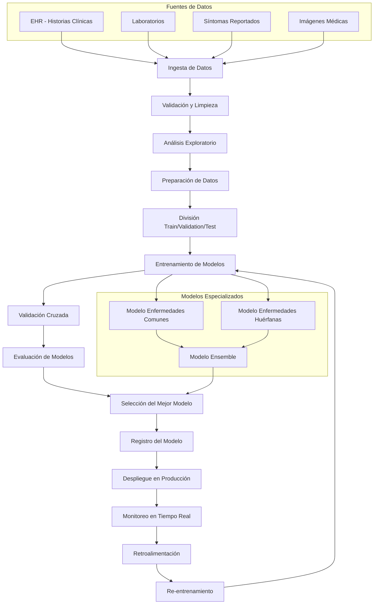

# Diagrama del Pipeline de MLOps

## Diagrama Mermaid

## Descripción de las Etapas

### 1. Ingesta de Datos
- **EHR (Electronic Health Records)**: Historias clínicas electrónicas
- **Laboratorios**: Resultados de análisis clínicos
- **Síntomas Reportados**: Información subjetiva del paciente
- **Imágenes Médicas**: Rayos X, resonancias, ecografías

### 2. Validación y Limpieza
- Verificación de integridad de datos
- Detección y manejo de valores faltantes
- Validación de formatos y rangos
- Eliminación de duplicados

### 3. Análisis Exploratorio
- Estadísticas descriptivas
- Visualización de distribuciones
- Detección de outliers
- Análisis de correlaciones

### 4. Preparación de Datos
- Normalización y estandarización
- Codificación de variables categóricas
- Feature engineering
- Balanceo de clases

### 5. División de Datos
- **Train (70%)**: Para entrenamiento
- **Validation (15%)**: Para ajuste de hiperparámetros
- **Test (15%)**: Para evaluación final

### 6. Entrenamiento de Modelos
- **Enfermedades Comunes**: Deep Learning, Ensemble Methods
- **Enfermedades Huérfanas**: Few-shot Learning, Transfer Learning
- **Modelos Híbridos**: Combinación de enfoques

### 7. Validación Cruzada
- K-fold cross-validation
- Validación temporal
- Validación por especialidad médica

### 8. Evaluación de Modelos
- Métricas clínicas (Sensibilidad, Especificidad)
- Métricas de calidad (AUC-ROC, F1-Score)
- Métricas de equidad
- Interpretabilidad

### 9. Selección del Mejor Modelo
- Comparación de métricas
- Análisis de trade-offs
- Validación clínica
- Aprobación médica

### 10. Registro del Modelo
- Versionado con MLflow
- Metadata completa
- Trazabilidad de datos
- Documentación clínica

### 11. Despliegue en Producción
- Containerización con Docker
- Orquestación con Kubernetes
- API REST para integración
- Interfaz web para médicos

### 12. Monitoreo en Tiempo Real
- Métricas de performance
- Drift de datos
- Alertas automáticas
- Dashboards en tiempo real

### 13. Retroalimentación
- Feedback de médicos
- Resultados de diagnósticos
- Casos de error
- Mejoras sugeridas

### 14. Re-entrenamiento
- Trigger automático por drift
- Re-entrenamiento programado
- Validación de nuevos modelos
- Despliegue gradual
